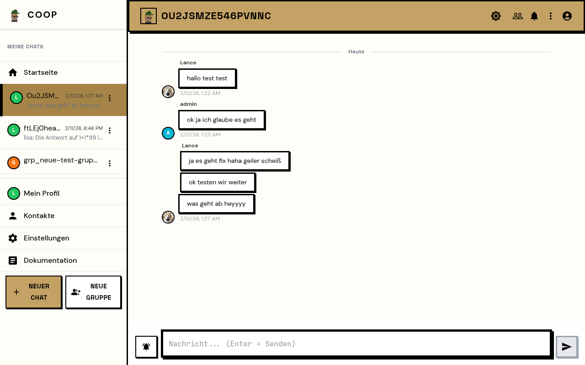
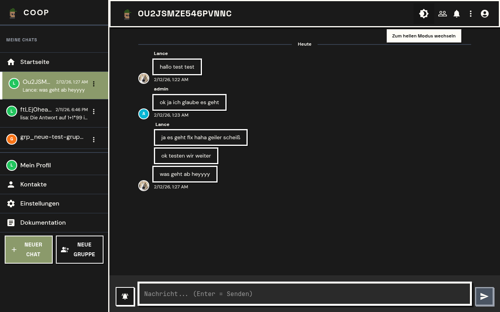
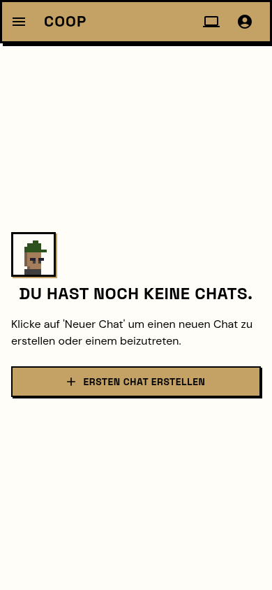
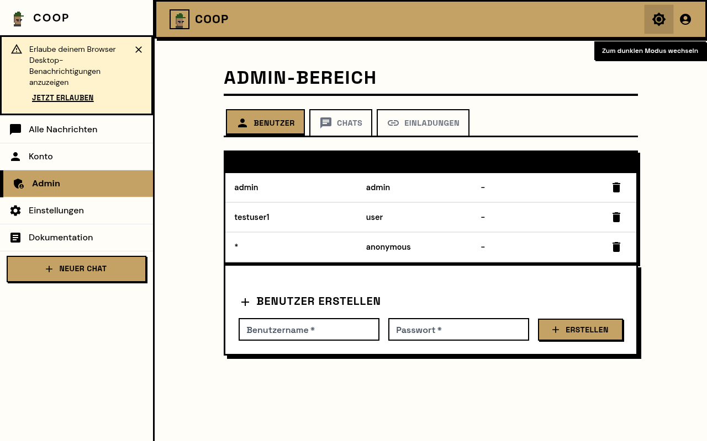
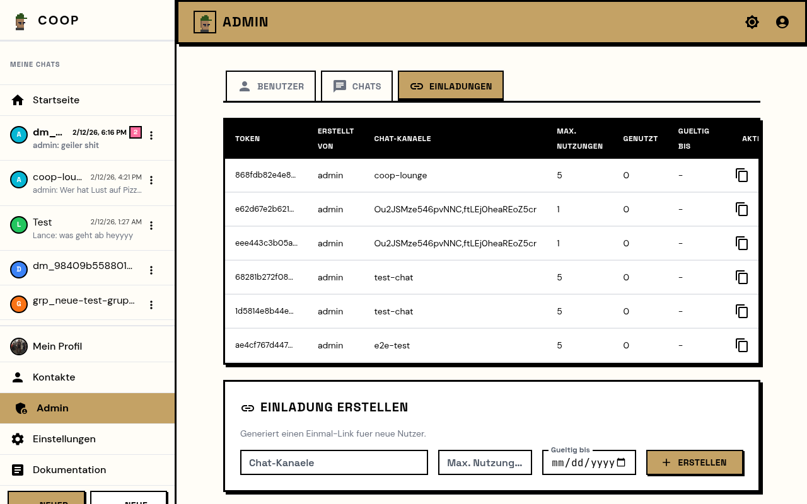

<div align="center">


# Coop Messenger

**A self-hosted, cooperative messenger built for real conversations.**

Your server. Your rules. Your messages.

[](https://github.com/LL4nc33/coop-messenger/releases)
[](LICENSE)
[](https://github.com/binwiederhier/ntfy)
[](https://go.dev)
[](https://react.dev)
[](https://docs.docker.com/compose/)
[](https://claude.ai)

</div>

---

Coop is a private messenger you host yourself. Built as a fork of the excellent [ntfy](https://github.com/binwiederhier/ntfy), Coop transforms the pub-sub notification engine into a full messaging experience with a modern UI, invite system, and admin controls.

> **Why "Coop"?** Short for *cooperative*. The idea is simple: messaging should be a shared, cooperative effort -- not controlled by a single corporation. You run the server, you own the data, and everyone cooperates on the same platform.

> **Built with AI.** Coop is developed AI-assisted using [Claude Code](https://claude.ai/claude-code). The architecture decisions, code, UI design, and documentation are a collaboration between a human developer and AI. We believe this is the future of open-source development.

## Screenshots

<p align="center">
  
  
</p>
<p align="center">
  
  
  
</p>

## Features

- **Real-time messaging** -- Send and receive messages instantly via WebSocket/SSE
- **Invite system** -- Create invite links to onboard new users or add existing users to chats
- **Join requests** -- Users can request access to chats; admins approve or deny
- **Neobrutalism UI** -- A distinctive design with bold borders, accent colors, and a dark mode
- **Mobile-first PWA** -- Installable as a Progressive Web App on any device
- **Admin panel** -- Manage users, chats, invites, and join requests from the browser
- **Invite-only by default** -- `auth-default-access: deny-all` keeps your instance private
- **File attachments** -- Share files and images within chats
- **Notification control** -- Mute chats, own messages don't trigger notifications
- **Theme customization** -- Light/dark mode with configurable accent colors
- **Share chat IDs** -- Users can share their chat ID via native share or clipboard
- **ntfy-compatible API** -- Works with existing [ntfy Android](https://github.com/binwiederhier/ntfy-android) and [iOS](https://github.com/binwiederhier/ntfy-ios) apps

## Quick Start

### Docker Compose (recommended)

1. **Clone the repository:**
   ```bash
   git clone https://github.com/LL4nc33/coop-messenger.git
   cd coop-messenger
   ```

2. **Configure the server:**
   ```bash
   # Edit config/server.yml to set your domain
   # At minimum, change base-url to your server's address
   nano config/server.yml
   ```

3. **Build and start:**
   ```bash
   docker compose up -d --build
   ```

4. **Create an admin user:**
   ```bash
   docker exec -it coop ntfy user add --role=admin admin
   ```

5. **Open the app:**
   Navigate to `http://localhost:9090` and log in with your admin account.

### Configuration

The server is configured via `config/server.yml`:

```yaml
# Your server's public URL (required for invite links)
base-url: "https://chat.yourdomain.com"

# Listen address (container-internal)
listen-http: ":80"

# Storage
cache-file: "/var/lib/coop/cache.db"
cache-duration: "87600h"  # 10 years

# Attachments
attachment-cache-dir: "/var/lib/coop/attachments"
attachment-expiry-duration: "0"  # Never expire

# Auth (invite-only by default)
auth-file: "/var/lib/coop/user.db"
auth-default-access: "deny-all"
enable-login: true
enable-signup: false
require-login: true
```

For all configuration options, see the [ntfy documentation](https://docs.ntfy.sh/config/).

## How It Works

### For Admins

1. **Create invite links** in the Admin Panel to invite users
2. **Manage chats** -- see all active channels and their stats
3. **Approve join requests** -- users can request access to chats they don't have permission for
4. **Monitor users** -- view and manage all registered users

### For Users

1. **Accept an invite** to create your account and join your first chats
2. **Create new chats** with auto-generated IDs
3. **Share chat IDs** so others can join (via the chat menu)
4. **Request to join** chats you don't have access to yet

### Mobile Apps

Since Coop is API-compatible with ntfy, you can use the existing mobile apps:

- **Android**: [ntfy on Google Play](https://play.google.com/store/apps/details?id=io.heckel.ntfy) or [F-Droid](https://f-droid.org/en/packages/io.heckel.ntfy/)
- **iOS**: [ntfy on App Store](https://apps.apple.com/us/app/ntfy/id1625396347)

Simply point the app at your Coop server URL and log in with your credentials.

## Tech Stack

| Layer | Technology |
|-------|-----------|
| Backend | Go 1.24, SQLite, WebSocket/SSE |
| Frontend | React 19, Vite, Material UI |
| Design | Neobrutalism (Space Grotesk, DM Sans, JetBrains Mono) |
| Storage | SQLite (messages, users, invites) + IndexedDB (client-side) |
| Deployment | Docker, Docker Compose |

## Roadmap

See [ROADMAP.md](docs/ROADMAP.md) for the full roadmap.

**Current priorities:**
- UX polish (auto-scroll, unread highlighting, date separators)
- Media previews and rich message content
- User profiles and avatars

**Long-term vision:**
Coop aims to become a **cooperative messaging network** where self-hosted servers can communicate with each other -- similar to how email or Matrix federation works. Run your own server, but still chat with people on other Coop instances. This is an ambitious goal and contributions are very welcome.

## Development

### Prerequisites

- Go 1.24+
- Node.js 18+
- Make

### Build from source

```bash
# Install web dependencies
make web-deps

# Build the web frontend
make web-build

# Build the server binary
make cli-linux-server
```

### Docker build

```bash
docker build --network=host -f Dockerfile-coop -t coop .
```

### Vite dev server (live reload for frontend)

```bash
cd web
npx vite --port 3001
```

The dev server proxies API calls to the backend on port 9090.

## Contributing

Contributions are welcome! Please read [CONTRIBUTING.md](CONTRIBUTING.md) before submitting a pull request.

## Acknowledgments

Coop is a fork of [ntfy](https://github.com/binwiederhier/ntfy) v2.17.0 by [Philipp C. Heckel](https://heckel.io). The original project provides the robust pub-sub engine, API, and mobile app ecosystem that Coop builds upon. While we've significantly modified the frontend, added a complete invite/join system, redesigned the UI with Neobrutalism, and rebuilt the user experience around messaging, the ntfy core remains the reliable backbone. Huge thanks to the ntfy community and all its contributors.

## License

Copyright (C) 2025 LL4nc33

This program is free software: you can redistribute it and/or modify it under the terms of the [GNU Affero General Public License](LICENSE) as published by the Free Software Foundation, either version 3 of the License, or (at your option) any later version.

The original ntfy code is dual-licensed under [Apache License 2.0](LICENSE.Apache-2.0) and [GPLv2](LICENSE.GPLv2). Coop's modifications and additions are licensed under AGPLv3.

### Third-party

- [ntfy](https://github.com/binwiederhier/ntfy) (Apache 2.0 / GPLv2) -- the foundation
- [React](https://react.dev) (MIT) -- web framework
- [Material UI](https://mui.com) (MIT) -- UI components
- [Dexie.js](https://github.com/dexie/Dexie.js) (Apache 2.0) -- IndexedDB wrapper
- [Space Grotesk](https://fonts.google.com/specimen/Space+Grotesk), [DM Sans](https://fonts.google.com/specimen/DM+Sans), [JetBrains Mono](https://fonts.google.com/specimen/JetBrains+Mono) -- fonts
- [go-sqlite3](https://github.com/mattn/go-sqlite3) (MIT) -- SQLite driver
- See ntfy's full [dependency list](https://github.com/binwiederhier/ntfy#license) for additional libraries
