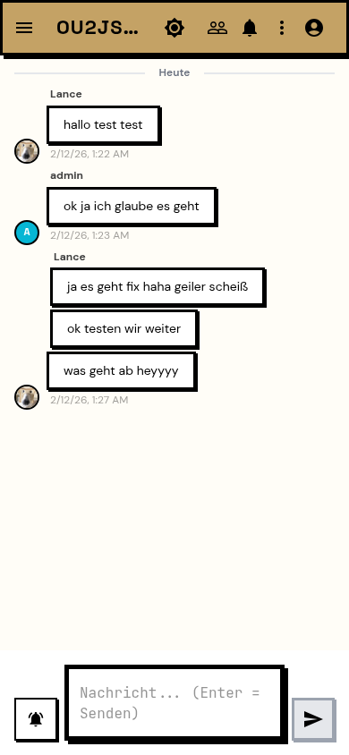

<div align="center">


# Coop Messenger

**A self-hosted, cooperative messenger built for real conversations.**

Your server. Your rules. Your messages.

[](https://github.com/LL4nc33/coop-messenger/releases)
[](LICENSE)
[](https://github.com/binwiederhier/ntfy)
[](https://go.dev)
[](https://react.dev)
[](https://docs.docker.com/compose/)
[](https://claude.ai)

</div>

---

Coop is a private messenger you host yourself. Built as a fork of the excellent [ntfy](https://github.com/binwiederhier/ntfy), Coop transforms the pub-sub notification engine into a full messaging experience with chat bubbles, user profiles, contacts, direct messages, groups, reactions, and a modern Neobrutalism UI.

> **Why "Coop"?** Short for *cooperative*. Messaging should be a shared, cooperative effort -- not controlled by a single corporation. You run the server, you own the data, and everyone cooperates on the same platform.

> **100% AI-assisted.** Every line of code, every design decision, every database migration -- all developed AI-assisted using [Claude Code](https://claude.ai/claude-code). A human developer steers the vision; AI writes the implementation.

## Screenshots

<p align="center">
  
  
</p>
<p align="center">
  
  
  
</p>

## Features

### Messaging
- **Real-time chat** -- Send and receive messages instantly via WebSocket/SSE
- **Chat bubbles** -- WhatsApp-style message bubbles with sender name, timestamp, and avatars
- **Message grouping** -- Consecutive messages from the same sender within 5 minutes are grouped together
- **Reply & quote** -- Reply to any message with a quoted preview
- **Emoji reactions** -- React to messages with 6 quick emojis (toggle on/off)
- **Markdown** -- All messages rendered as Markdown (bold, links, code blocks)
- **Media previews** -- Inline image/video/audio previews with a fullscreen lightbox
- **Link previews** -- Domain display for URLs in messages

### Social
- **User profiles** -- Display name, bio/status, and avatar (upload JPEG/PNG/WebP/GIF)
- **Online status** -- Green (online), yellow (recently active), gray (offline)
- **Contacts** -- Search users, send contact requests, accept/reject/block
- **Direct messages** -- Start 1:1 chats from a profile or contact list
- **Groups** -- Create group chats with a name and selected members
- **Privacy settings** -- Control who can contact you (open / request-only / invite-only)
- **Member list** -- See all members of a chat with online status (slide-out drawer)
- **Typing indicator** -- "XY is typing..." with animated dots (3s rate limit)
- **Nudge** -- Poke someone with a shake animation (30s rate limit)
- **Slash commands** -- `/gurr` (nudge), `/status <text>`, `/flieg` (leave), `/mitglieder` (members)

### Access & Admin
- **Invite system** -- Create invite links with usage limits and expiry dates
- **Join requests** -- Users can request access to chats; admins approve or deny
- **Invite-only by default** -- `auth-default-access: deny-all` keeps your instance private
- **Admin panel** -- Manage users, chats, invites, and join requests from the browser
- **Auto-subscription** -- Users automatically see chats they're invited to (no manual setup)

### UI & Design
- **Neobrutalism design** -- Bold 3px borders, no border-radius, accent colors, strong shadows
- **Theme toggle** -- Light / Dark / System (3-stage toggle)
- **Accent colors** -- 4 presets (Sand, Khaki, Olive, Gold) + custom color picker
- **Mobile-friendly** -- Responsive layout with swipe drawer, works on any device
- **German UI** -- Complete German localization (590+ i18n keys)
- **Smart auto-scroll** -- Only scrolls on new messages when at bottom; "New messages" button otherwise
- **Unread badges** -- Pink counter badges per chat in the sidebar
- **Date separators** -- "Today", "Yesterday", DD.MM.YYYY between messages

### Infrastructure
- **Self-contained** -- Single Go binary embeds the React frontend, SQLite for storage
- **Docker ready** -- One command to build and deploy
- **No external dependencies** -- No Redis, no Postgres, no message broker needed
- **File attachments** -- Share files and images within chats (ntfy attachment system)

## Quick Start

### Docker Compose (recommended)

1. **Clone the repository:**
   ```bash
   git clone https://github.com/LL4nc33/coop-messenger.git
   cd coop-messenger
   ```

2. **Configure the server:**
   ```bash
   # Edit config/server.yml to set your domain
   # At minimum, change base-url to your server's address
   nano config/server.yml
   ```

3. **Build and start:**
   ```bash
   DOCKER_BUILDKIT=1 docker build --network=host -f Dockerfile-coop -t coop .
   docker compose up -d
   ```

4. **Create an admin user:**
   ```bash
   docker exec -it coop ntfy user add --role=admin admin
   ```

5. **Open the app:**
   Navigate to `http://localhost:9090` and log in with your admin account.

### Configuration

The server is configured via `config/server.yml`:

```yaml
# Your server's public URL (required for invite links)
base-url: "https://chat.yourdomain.com"

# Listen address (container-internal)
listen-http: ":80"

# Storage
cache-file: "/var/lib/coop/cache.db"
cache-duration: "87600h"  # 10 years

# Attachments
attachment-cache-dir: "/var/lib/coop/attachments"
attachment-expiry-duration: "0"  # Never expire

# Auth (invite-only by default)
auth-file: "/var/lib/coop/user.db"
auth-default-access: "deny-all"
enable-login: true
enable-signup: false
require-login: true
```

For all configuration options, see the [ntfy documentation](https://docs.ntfy.sh/config/).

## How It Works

### For Admins

1. **Create invite links** in the Admin Panel -- set usage limits and expiry
2. **Manage chats** -- see all active channels with message counts and last activity
3. **Approve join requests** -- users can request access to chats they don't have permission for
4. **Grant access** -- add users to chats directly (they'll see the chat automatically)
5. **Monitor users** -- view, create, and manage all registered users

### For Users

1. **Accept an invite** to create your account and join your first chats
2. **Set up your profile** -- add an avatar, display name, and status
3. **Add contacts** -- search for users, send contact requests
4. **Start DMs** -- open a direct message from any profile or contact
5. **Create groups** -- pick a name and members to start a group chat
6. **React & reply** -- emoji reactions and quoted replies on any message
7. **Use slash commands** -- type `/` to see available commands

### Mobile

Coop works in any mobile browser with a responsive layout and swipe drawer. A proper PWA manifest for "Add to Home Screen" and native Android/iOS apps are on the [roadmap](docs/ROADMAP.md).

## Tech Stack

| Layer | Technology |
|-------|-----------|
| Backend | Go 1.24, SQLite, WebSocket/SSE |
| Frontend | React 19, Vite, Material UI 5 |
| Design | Neobrutalism (Space Grotesk, DM Sans, JetBrains Mono) |
| Storage | SQLite (cache.db for messages, user.db for auth/profiles) + IndexedDB (client-side) |
| Deployment | Docker, Docker Compose |

## Roadmap

See [ROADMAP.md](docs/ROADMAP.md) for the full roadmap.

**Current priorities:**
- Security hardening and release readiness
- Attachment button in chat (drag & drop, clipboard paste)
- Web Push notifications and PWA improvements
- Public instance at chatcoop.at

**Long-term vision:**
Coop aims to become a **cooperative messaging network** where self-hosted servers can communicate with each other -- similar to how email or Matrix federation works. End-to-end encryption, native apps (Android/iOS/Desktop), and voice/video calls are all planned. See the [roadmap](docs/ROADMAP.md) for details.

## Development

### Prerequisites

- Go 1.24+
- Node.js 18+
- Make

### Build from source

```bash
# Install web dependencies
make web-deps

# Build the web frontend
make web-build

# Build the server binary
make cli-linux-server
```

### Docker build

```bash
DOCKER_BUILDKIT=1 docker build --network=host -f Dockerfile-coop -t coop .
```

### Vite dev server (live reload for frontend)

```bash
cd web
npx vite --port 3001
```

The dev server proxies API calls to the backend on port 9090.

## Contributing

Contributions are welcome! Please read [CONTRIBUTING.md](CONTRIBUTING.md) before submitting a pull request.

## Acknowledgments

Coop is a fork of [ntfy](https://github.com/binwiederhier/ntfy) v2.17.0 by [Philipp C. Heckel](https://heckel.io). The original project provides the robust pub-sub engine, API, and mobile app ecosystem that Coop builds upon. While we've significantly modified the frontend, added user profiles, contacts, DMs, groups, reactions, a complete invite/join system, redesigned the UI with Neobrutalism, and rebuilt the user experience around messaging, the ntfy core remains the reliable backbone. Huge thanks to the ntfy community and all its contributors.

## License

Copyright (C) 2025-2026 LL4nc33

This program is free software: you can redistribute it and/or modify it under the terms of the [GNU Affero General Public License](LICENSE) as published by the Free Software Foundation, either version 3 of the License, or (at your option) any later version.

The original ntfy code is dual-licensed under [Apache License 2.0](LICENSE.Apache-2.0) and [GPLv2](LICENSE.GPLv2). Coop's modifications and additions are licensed under AGPLv3.

### Third-party

- [ntfy](https://github.com/binwiederhier/ntfy) (Apache 2.0 / GPLv2) -- the foundation
- [React](https://react.dev) (MIT) -- web framework
- [Material UI](https://mui.com) (MIT) -- UI components
- [Dexie.js](https://github.com/dexie/Dexie.js) (Apache 2.0) -- IndexedDB wrapper
- [Space Grotesk](https://fonts.google.com/specimen/Space+Grotesk), [DM Sans](https://fonts.google.com/specimen/DM+Sans), [JetBrains Mono](https://fonts.google.com/specimen/JetBrains+Mono) -- fonts
- [go-sqlite3](https://github.com/mattn/go-sqlite3) (MIT) -- SQLite driver
- See ntfy's full [dependency list](https://github.com/binwiederhier/ntfy#license) for additional libraries
